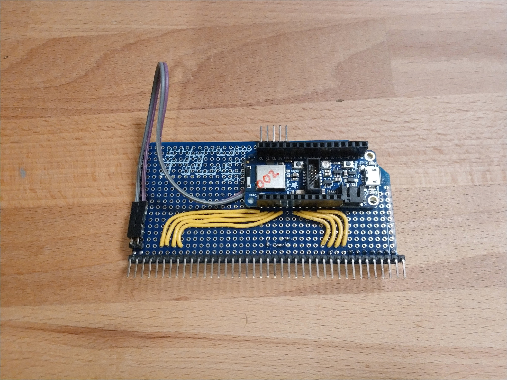

# Arbitrator

The first Stargazer Arbitrator module was based on an Adafruit nRF52840 Express. It required no additional components.

It was built on top of an RC2014 Prototype card.

Note that Pin 1 was actually **ABOVE** the card, as the Prototype card only had 39 pins.

For a list of signal lines, please see the [Backplane Page](./backplane.md).

## Original Design

<iframe src="https://docs.google.com/spreadsheets/d/e/2PACX-1vT3J_2iVo-lzCukgcFDAjcl-GEsIKxaw_oywTx9RMT32N-gR-FY_e9K6NDwA9xq16rH9nns92SXnEGX/pubhtml?gid=269970793&amp;single=true&amp;widget=true&amp;headers=false" style="height: 1350px;width: 900px;"></iframe>
