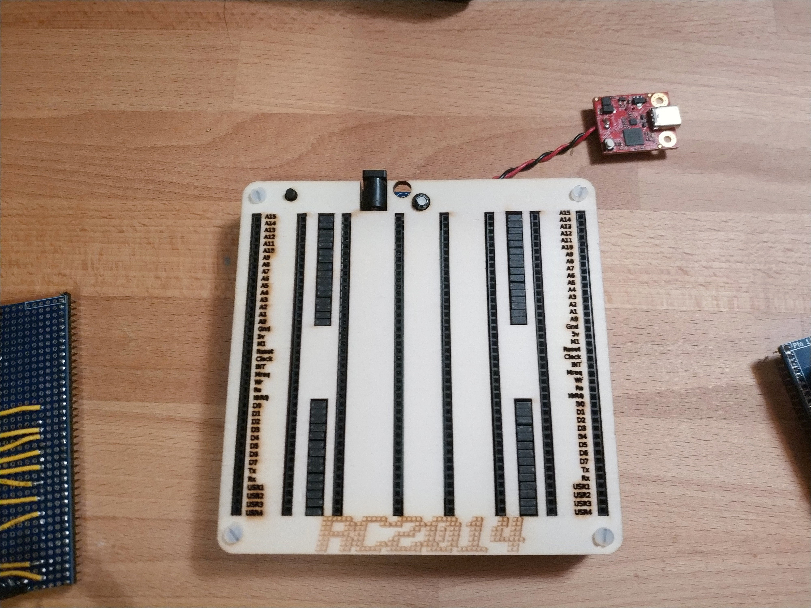

# Backplane

The Stargazer Backplane was an 8 socket RC2014 backplane module, originally inteded for Z80 based PCs.

It features 40 parallel pin connections for the 8 card slots.

The Stargazer Backplane also featured a USB-PD compatible USB-C module to provide up 5V/3A for use by the attached cards.

## Pinout

The following pinout was used for the Stargazer Backplane:

| Pin Number | RC2014 Name | Anachro Stargazer Name | Notes |
| :---       | :---        | :---                   | :---  |
| 1          | A15         | CARD1-GO               | |
| 2          | A14         | CARD2-GO               | |
| 3          | A13         | CARD3-GO               | |
| 4          | A12         | CARD4-GO               | |
| 5          | A11         | CARD5-GO               | |
| 6          | A10         | CARD6-GO               | |
| 7          | A09         | CARD7-GO               | |
| 8          | A09         | CARD8-GO               | This was actually a mistake. I only needed 7 select lines, but had already soldered the following SPI pins. |
| 9          | A08         | CARDx-COPI             | |
| 10         | A07         | CARDx-SCK              | |
| 11         | A06         | CARDx-CSn              | |
| 12         | A05         | CARDx-CIPO             | |
| 13         | A03         | RESERVED               | Not used by the Stargazer |
| 14         | A02         | RESERVED               | Not used by the Stargazer |
| 15         | A01         | RESERVED               | Not used by the Stargazer |
| 16         | A00         | RESERVED               | Not used by the Stargazer |
| 17         | GND         | GND                    | |
| 18         | 5v          | +5v                    | |
| 19         | M1          | 3v3                    | This was used to supply power to the keyboard from the CPU |
| 20         | Reset       | Reset                  | |
| 21         | Clock       | SWDIO-1                | |
| 22         | INT         | SWCLK-1                | |
| 23         | Nreq        | SWDIO-2                | |
| 24         | Wr          | SWCLK-2                | |
| 25         | Ro          | SWDIO-3                | |
| 26         | IORQ        | SWCLK-3                | |
| 27         | D0          | SWDIO-4                | |
| 28         | D1          | SWCLK-4                | |
| 29         | D2          | SWDIO-5                | |
| 30         | D3          | SWCLK-5                | |
| 31         | D4          | SWDIO-6                | |
| 32         | D5          | SWCLK-6                | |
| 33         | D6          | SERIAL2-TX             | This was the Keyboard Serial Port |
| 34         | D7          | SERIAL2-RX             | This was the Keyboard Serial Port |
| 35         | Tx          | SERIAL1-TX             | This was the Display Serial Port |
| 36         | Rx          | SERIAL1-RX             | This was the Display Serial Port |
| 37         | USR1        | SWDIO-7                | This was used for the Keyboard SWD |
| 38         | USR2        | SWCLK-7                | This was used for the Keyboard SWD |
| 39         | USR3        | SWDIO-ARB              | |
| 40         | USR4        | SWCLK-ARB              | |
