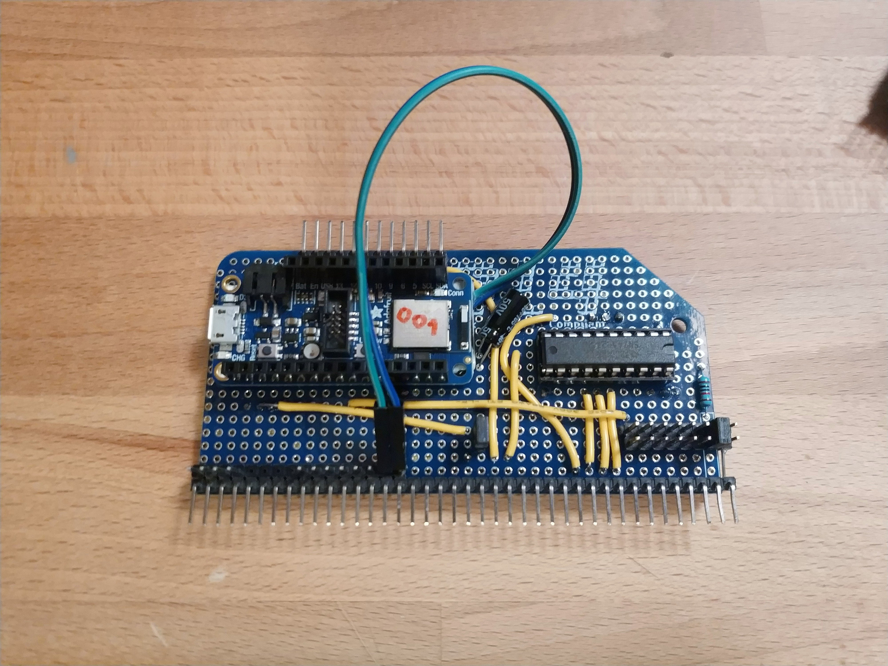

# CPU

The first Stargazer CPU module was based on an Adafruit nRF52840 Express. It included a TI SN74AC245N to gate access to the shared SPI bus based on the "GO" signal as an output enable line.

It was built on top of an RC2014 Prototype card.

Note that Pin 1 was actually **ABOVE** the card, as the Prototype card only had 39 pins.

For a list of signal lines, please see the [Backplane Page](./backplane.md).
