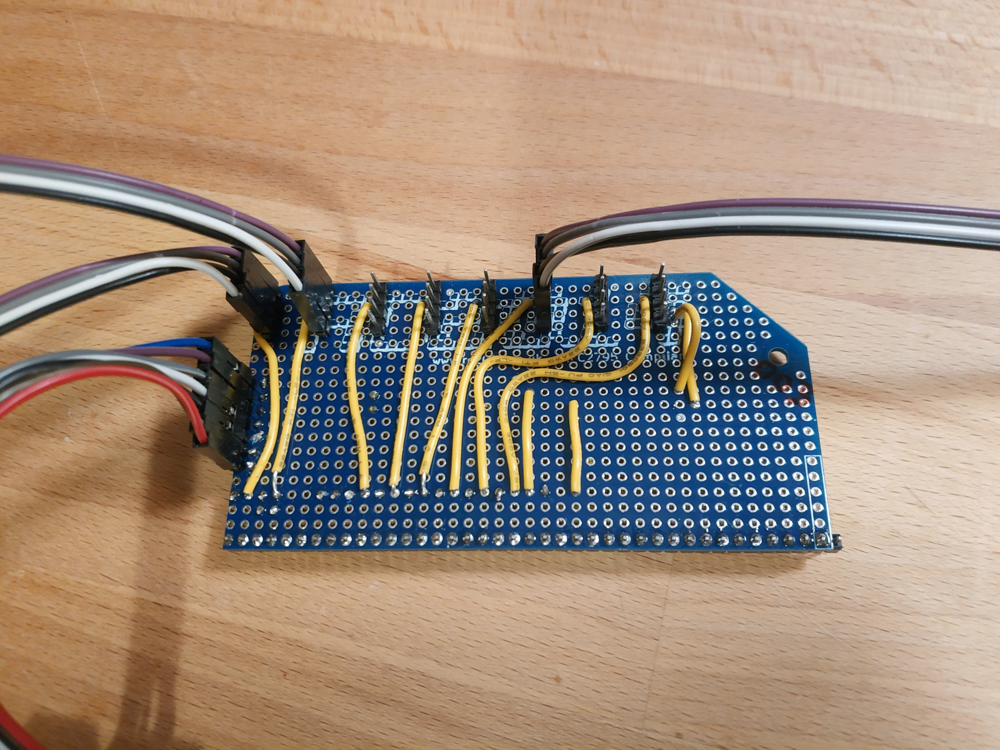

# Debug Card

The first Stargazer Debug Card was intended to break out the SWD lines (Clock, Data In/Out, Ground, and Reset) for each card. It also provided a connector for the [Keyboard](./key-003.md) to connect to the Arbitrator via UART.

It was built on top of an RC2014 Prototype card.

Note that Pin 1 was actually **ABOVE** the card, as the Prototype card only had 39 pins.

For a list of signal lines, please see the [Backplane Page](./backplane.md).

## Pinout

The following pinout was used for each of the debug headers. This is from Left to Right.

| Pin Number | Color in Photo | Signal          |
| :---       | :---           | :---            |
| 1          | Purple         | CARDn-SWDCLK    |
| 2          | Grey           | CARDn-SWDIO     |
| 3          | Black          | Ground (common) |
| 4          | White          | Reset (common)  |

The headers were connected in the following order, Top to Bottom:

* Card 1 SWD
* Card 2 SWD
* Card 3 SWD
* Card 4 SWD
* Card 5 SWD
* Card 6 SWD
* Card 7/Keyboard SWD (common)
* Arbitrator SWD

Below all SWD headers, is a Keyboard Header. This pinout matches the headers on the MakerDiary M60. These pins are numbered from Left to Right

| Pin Number | Color in Photo | Signal          |
| :---       | :---           | :---            |
| 1          | Blue           | Key-TXD/Arb-RXD |
| 2          | Purple         | Key-RXD/Arb-TXD |
| 3          | Grey           | SWDIO           |
| 4          | White          | SWCLK           |
| 5          | Black          | RESET           |
| 6          | Brown          | Ground (common) |
| 7          | Red            | +3v3            |
