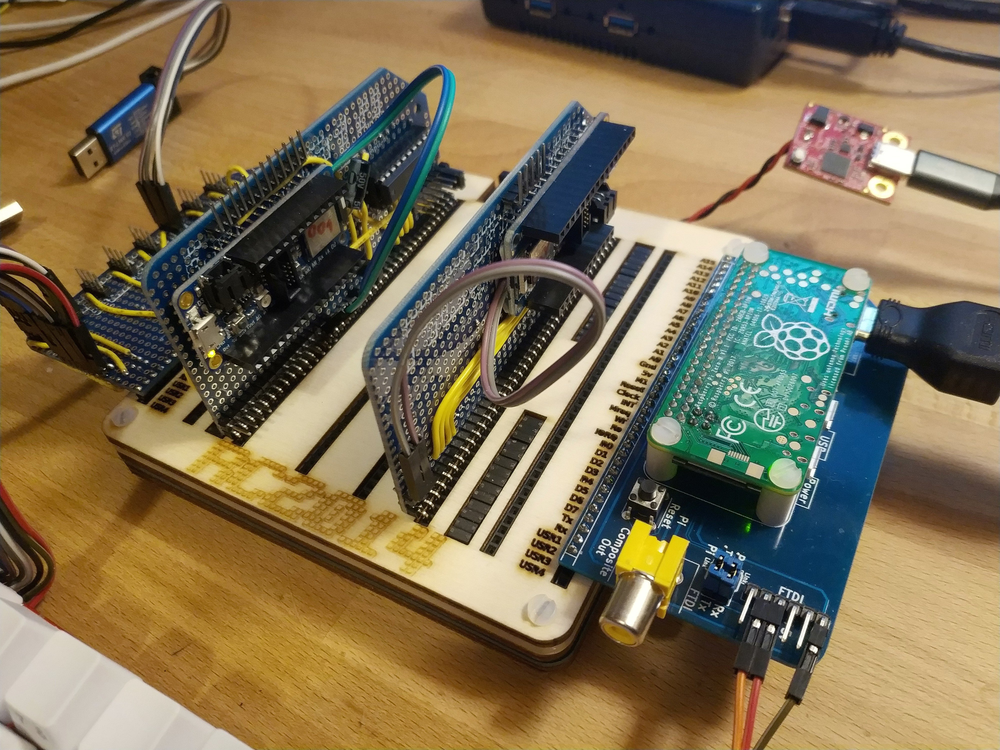

# Stargazer

The Anachro Stargazer was the first Anachro-PC, designed to be demonstrated at RustLab 2020.

It was built out of an RC2014 Z80 Backplane and Proto board kit, as well as with hardware modules from Adafruit, MakerDiary, and a Raspberry Pi.

It featured:

* [An Arbitrator](./arb-002.md)
* [A backplane](./backplane.md)
* [A CPU](./cpu-001.md)
* [A Keyboard](./key-003.md)
* [An HDMI display interface](./rpi-004.md)

The "Stargazer" name comes from the [Stargazer Lily](https://en.wikipedia.org/wiki/Lilium_%27Stargazer%27).
