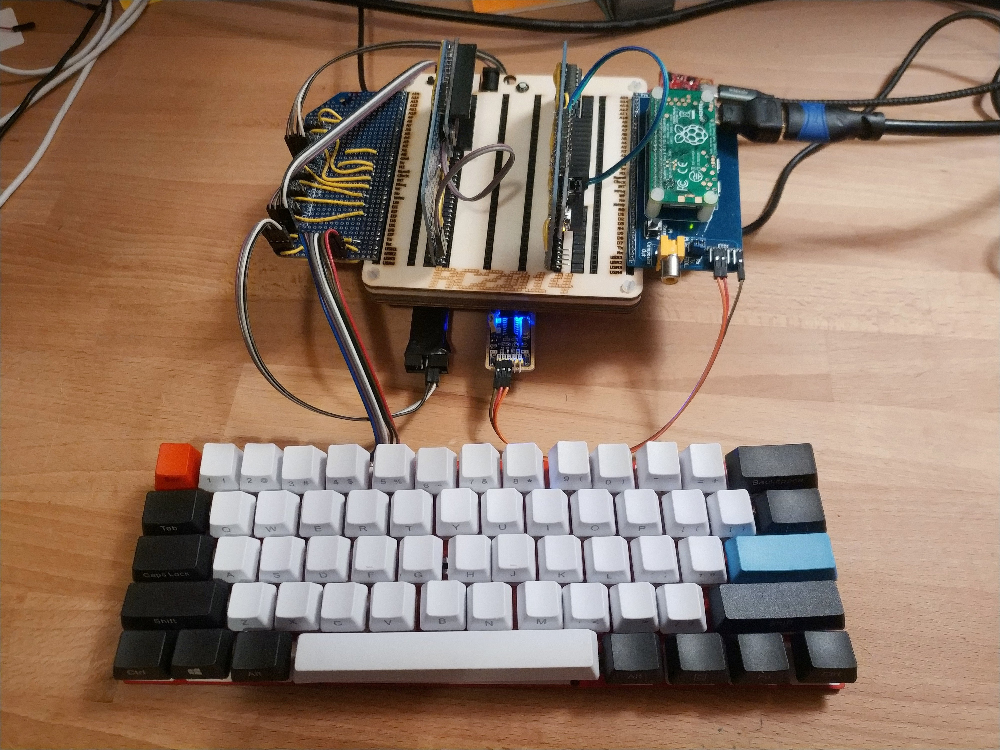

# Keyboard

The Keyboard for the Anachro Stargazer was a MakerDiary M60. It contains a Nordic nRF52840. It was connected to the PC via the [Debug Card](./debug-card.md), using the programming/serial port header available on the M60.
