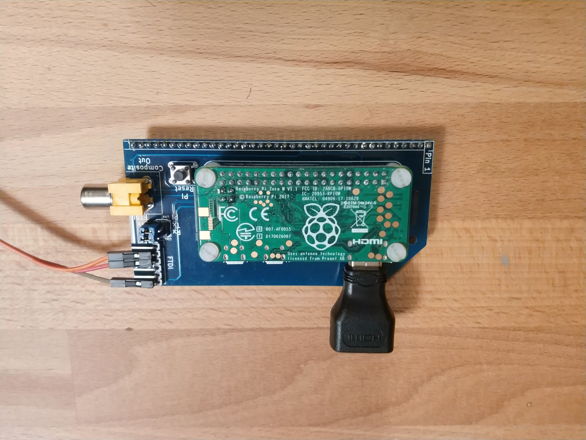

# Display Adapter

The Stargazer Display Adapter was a Raspberry Pi Zero W, connected to an RC2014 Console Module.

It also had an FTDI breakout header for connecting the serial lines to an external device.

Currently, only the following signals are connected:

* GND
* +5v
* Reset
* SERIAL1-TX
* SERIAL1-RX

For a list of signal lines, please see the [Backplane Page](./backplane.md).

Note that the Console Module card does not connect Pins 39 and 40.
