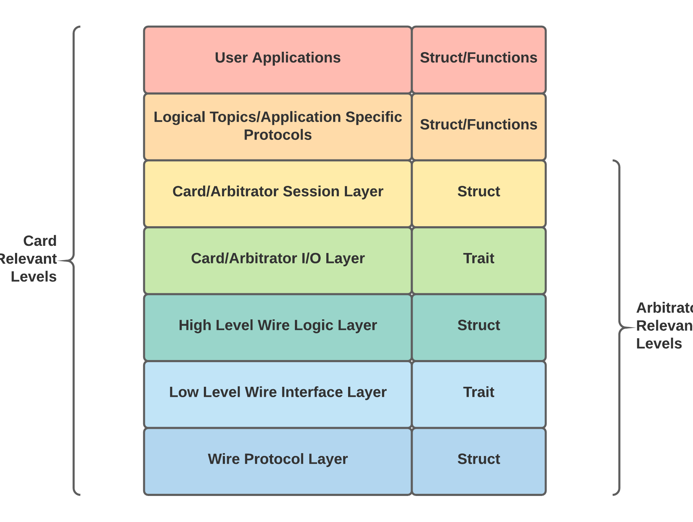

# Network Layers

The Anachro Protocol is implemented across seven distinct layers, separated to make it easier to port the Anachro Protocol to new transports and physical hardware. These layers include (in descending order):

* **The Application Layer**
    * The Application Layer is intended to be the individual "business logic" responsibilities for each card.
    * A given card may have one or more "applications", that describe a single responsibility
    * This layer is only relevant to Cards, as routing of messages is transparent to the Arbitrator.
    * This layer is implemented by each Card.
* **The Routing Layer**
    * The Routing Layer is intended to manage the distribution of messages received from the Arbitrator to individual components of a Card's Application.
    * This could include handling of messages from different planes (e.g. Pub/Sub, Object Store, etc.), or messages from within a given plane (e.g. different pub/sub topics on the Pub/Sub plane).
    * This layer is only relevant to Cards, as routing of messages is transparent to the Arbitrator.
    * This layer is implemented by each Card, with components provided by the Anachro Card/Client library.
* **The Protocol Layer**
    * The Protocol Layer is intended to manage the connection between an Arbitrator and a Card.
    * The Protocol Layer is implemented as a Struct that can be paired with one or more implementors of The Protocol Interface
    * Cards will typically have a single Protocol Layer, used to communicate with the Arbitrator
    * The Arbitrator may have one or more Protocol Layers it supports, depending on the connection topology to the Cards it will connect to.
* **The Protocol Interface**
    * The Protocol Interface is a connection between the Protocol Layer and the Data Link Layer
    * The Protocol Interface is implemented as a minimally specific Trait, which allows multiple Data Link Layer implementations to be used interchangeably with a single Protocol Layer.
    * This layer is generally a simple "Send Frame" or "Receive Frame" interface.
    * This layer is defined within the Anachro Protocol, and is not typically re-implemented by end users.
* **The Data Link Layer**
    * The Data Link Layer is intended to handle any Anachro-specific usages of a given Physical Layer, such as Anachro's use of a "GO" signal and shared-peripheral orientation over an SPI link.
    * In some cases, dedicated Data Link, Data Link Interface, and Physical layers may not be necessary when using a straightforward line protocol, such as "COBS framed bidirectional UART".
    * This layer is typically implemented as a struct that contains a generic Physical Layer struct, which implements the associated Data Link Interface trait.
    * This layer typically implements the Protocol Interface Layer trait.
    * This layer is typically either provided as part of the Anachro Protocol (for already implemented physical transports), or to be implemented by end-users when porting to a new physical transport or hardware platform.
* **The Data Link Interface**
    * The Data Link Interface is a connection between the Data Link Layer and the Physical Layer
    * The Data Link Interface is typically implemented as a minimally specific Trait, which allows multiple Physical Layer implementations to be used interchangeably with a single Data Link Layer.
    * This layer is analogous to interfaces like `embedded-hal`'s SPI, UART, or I2C traits.
    * This layer is typically either provided as part of the Anachro Protocol (for already implemented physical transports), or to be implemented by end-users when porting to a new physical transport or hardware platform.
* **The Physical Layer**
    * The physical layer is intended to handle the interactions between the Anachro network stack and specific microcontroller peripherals, such as SPI, UART, etc.
    * The physical layer is typically implemented as a struct that contains the hardware specific peripheral and associated logic
    * This layer is typically either provided as part of the Anachro Protocol (for already implemented physical transports), or to be implemented by end-users when porting to a new physical transport or hardware platform.
    * This layer typically implements the Data Link Interface trait.
